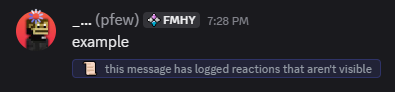
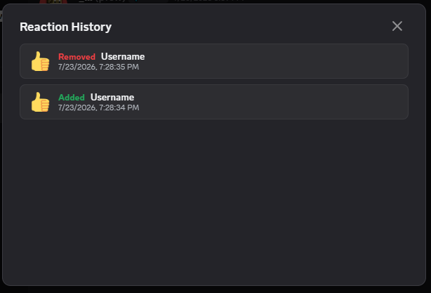
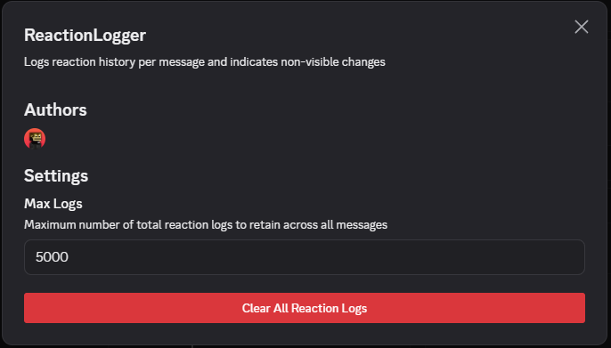

 # ReactionLogger

###### This plugin was completely vibe coded the code probably sucks feel free to submit issues or pull requests

* ReactionLogger is a Vencord plugin that logs all message reaction history and saves it locally.
* logs who reacted to a message as well as the precise timestamp of when.
* shows a visual indicator below messages if it has logged a reaction that isn't the same as what is displayed.
* can adjust total stored logs or wipe log data anytime via plugin settings


---






---


## Installation


1. Install [Node.js](https://nodejs.org/en), [git](https://git-scm.com/install/), and [pnpm](https://pnpm.io/installation) if you don't already have them.
2. Clone Vencord's Github repository:
```sh
git clone https://github.com/Vendicated/Vencord
cd Vencord
```
3. Navigate to the `src` folder in the cloned Vencord repository, create a new folder called `userplugins` if it doesn't already exist.
4.  Inside `userplugins`, create a folder called `ReactionLogger`, then download `index.tsx` from this repository and move it into that folder (so the path is `src/userplugins/ReactionLogger/index.tsx`).
5.  Build Vencord and inject Discord:
```sh
pnpm build
pnpm inject
```
[Official Vencord custom plugin installation guide](https://docs.vencord.dev/installing/custom-plugins/)
